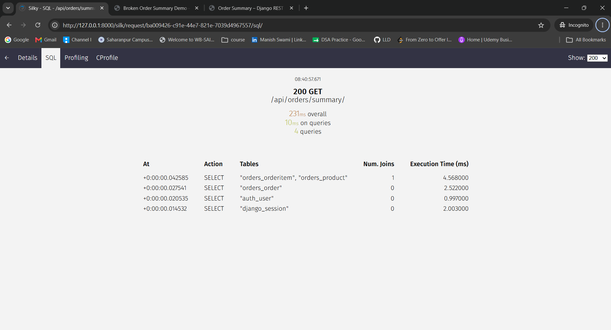
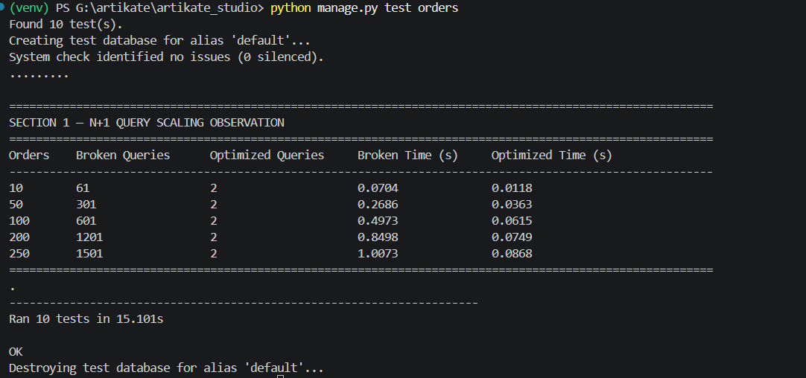

# Django Backend Engineering Assessment

This project contains my solution for the Django backend engineering assessment.

##  NOTE :: please log in with username/password : testuser/testuser 

## Demo link  https://drive.google.com/file/d/1CoKy39uhPJplAK7jLaCesImn2Od28AbC/view?usp=sharing

## Section 1 — Diagnose a Broken System

The goal of this section is to investigate and fix a performance regression in the following endpoint:

    GET /api/orders/summary/

The endpoint works normally for small datasets but becomes increasingly slow as the number of orders and related items grows.

## Root Cause

The root cause is a nested N+1 query problem caused by Django ORM lazy loading.

The data model is:

    User
      └── Order
            └── OrderItem
                    └── Product

The broken implementation loads Orders first. During serialization, Django then executes additional queries when accessing:

    order.items.all()

and:

    item.product

Without ORM optimization, the query count grows with the number of orders and items.

For example, with 200 orders and 5 items per order:

    1 query      -> Fetch Orders
    200 queries  -> Fetch OrderItems for each Order
    1000 queries -> Fetch Product for each OrderItem

    Total = 1201 queries

## Solution

The optimized implementation uses:

- `prefetch_related()` for the reverse `Order -> OrderItem` relationship.
- `select_related("product")` for the forward `OrderItem -> Product` ForeignKey.

The optimized data-loading path requires only:

    Query 1 -> Fetch Orders

    Query 2 -> Fetch all related OrderItems
               and JOIN Product in the same query

Therefore, the core query count remains constant at 2 queries for a non-empty result set.

## Project Setup

### 1. Create a virtual environment

Windows PowerShell:

    python -m venv venv
    .\venv\Scripts\Activate.ps1

### 2. Install dependencies

    pip install -r requirements.txt

### 3. Apply migrations

    python manage.py migrate

### 4.1. create superuser user and login   on  http://127.0.0.1:8000/admin/
if using same db no need to create new user
 superusername :  testuser    ## need to be same as we are inserting some record for this user 
 password : any 

### 4. Run the tests

    python manage.py test orders -v 2

All tests should pass.

## Run the Application

Start the Django development server:

    python manage.py runserver

The application will be available at:

    http://127.0.0.1:8000/

## API Endpoints

Optimized endpoint:

    GET /api/orders/summary/

Broken endpoint used only for reproducing the N+1 problem:

    GET /api/orders/summary/debug-broken/

The broken endpoint is included only for local debugging and profiler comparison.

## Test Data

To create test data for profiling:

    python manage.py seed_orders --orders 250 --items-per-order 5 --username testuser

This creates:

    250 Orders
    5 OrderItems per Order
    1250 OrderItems total

## Performance Profiling with django-silk

This project uses `django-silk` to inspect:

- Request execution time
- SQL query count
- Individual SQL queries
- Repeated query patterns

Start the server:

    python manage.py runserver

Call the broken endpoint:

    http://127.0.0.1:8000/api/orders/summary/debug-broken/?page_size=100

Call the optimized endpoint:

    http://127.0.0.1:8000/api/orders/summary/?page_size=100

Then open the Silk dashboard:

    http://127.0.0.1:8000/silk/

The broken implementation shows query growth as the number of orders and items increases.

The optimized implementation keeps the core data-loading query count constant.

## Tests

The test suite contains two categories.

### Correctness Tests

These verify that:

- A user with no orders receives an empty list.
- A user cannot see another user's orders.
- An order without items is handled correctly.
- Orders and nested items are returned correctly.

### Query Performance Tests

These verify that:

- The optimized implementation uses 2 queries for one order.
- The optimized implementation still uses 2 queries for many orders.
- Increasing the number of items does not increase the optimized query count.
- The broken implementation demonstrates the N+1 query problem.
- The broken and optimized implementations return identical data.

## Project Structure

    .
    ├── README.md
    ├── manage.py
    ├── requirements.txt
    │
    ├── orders/
    │   ├── models.py
    │   ├── serializers.py
    │   ├── service.py
    │   ├── views.py
    │   ├── urls.py
    │   │
    │   ├── management/
    │   │   └── commands/
    │   │       └── seed_orders.py
    │   │
    │   └── tests/
    │       ├── __init__.py
    │       ├── factories.py
    │       ├── test_correctness.py
    │       └── test_query_performance.py
    │
    └── artikate_studio/
        ├── settings.py
        └── urls.py

## Summary

The performance regression was caused by a nested N+1 query problem.

The broken implementation performs repeated database queries while traversing related objects during serialization.

The fix uses Django's `prefetch_related()` and `select_related()` mechanisms to reduce the core data-loading path to 2 queries while preserving the same API response.

